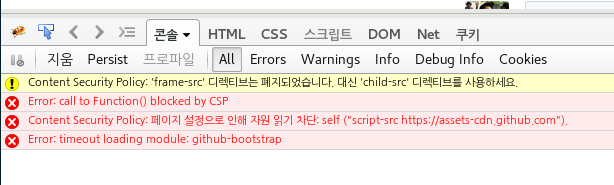

제가 쓰는 브라우저는 [firefox](https://www.mozilla.org/ko/firefox/new/) 이고
주업무의 이슈트래킹은 [github](https://github.com) 에서 하고 있습니다.
거의 모든 편집은 emacs 에서 하고요.(지금도 emacs 에서 편집하고 있습니다.)

셋중 하나만 안되도 뭘 못합니다.

작년인가부터 Debian 에서 iceweasel 대신에 firefox 를 지원해주기 시작해서 데비안 패키지
firefox 를 사용하고 있습니다.(`firefox ESR 45.9.0`)

그런데 오늘(2017-05-09 투표날) github project 도 안보이고 assignee 도 지정할 수 없고
comment 에 사진도 업로드가 아니되는 것 입니다.

크롬이나 다른 브라우저 쓰면 되긴 하지만, 여러 플러그인 설정과

- [vimfx](https://addons.mozilla.org/en-US/firefox/addon/vimfx/)
- [markdown-here](https://addons.mozilla.org/en-US/firefox/addon/markdown-here/)
- send to kindle
- uBlock
- awesome screenshot

북마크등을 옮기려고 생각하면 아찔합니다.

괴롭다..
