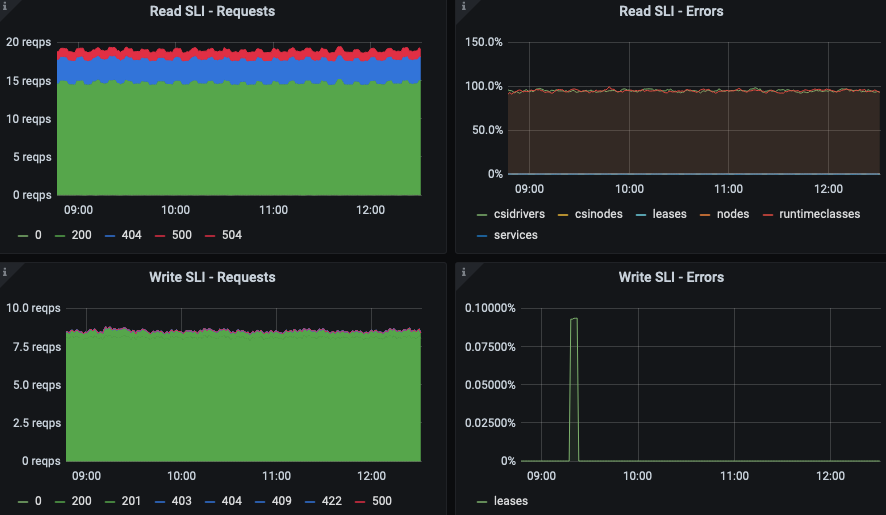

on-premise 에서 운영중이던 `1.20` 클러스터에서 [KubeAPIErrorBudgetBurn](https://monitoring.mixins.dev/kubernetes/#kube-apiserver-slos) alert 이 발생

> The API server is burning too much error budget.
> API 서버가 너무 많은 오류 예산을 소모하고 있습니다.

용어가 생소해서 무서웡.

- [burn rate](https://sre.google/workbook/alerting-on-slos/#4-alert-on-burn-rate)
- [error budget](https://www.atlassian.com/incident-management/kpis/error-budget)
- SLI: Service Level Indicator
- SLA: Service Level Agreement

얼추 SLA 가 99% 라고 가정한다면, (우리 서비스는 연 99% 의 가용성을 보장합니다. 라고 뻥쳤다면..)
burn rate 가 늘어나면 이를 만족 시킬 수 없음.
시간이 지남에 따라 burn rate 에 비례해서 SLA 도 낮아짐.

이러한 상황을 대비해서 전문가형님들이 `KubeAPIErrorBudgetBurn` 이라는 alert rule 을 정의해 놓은 것인데 이게 발생.

```
alert: KubeAPIErrorBudgetBurn
annotations:
  description: The API server is burning too much error budget.
  runbook_url: https://github.com/kubernetes-monitoring/kubernetes-mixin/tree/master/runbook.md#alert-name-kubeapierrorbudgetburn
  summary: The API server is burning too much error budget.
expr: |
  sum(apiserver_request:burnrate1h) > (14.40 * 0.01000)
  and
  sum(apiserver_request:burnrate5m) > (14.40 * 0.01000)
for: 2m
labels:
  long: 1h
  severity: critical
  short: 5m
```

대충 쓰면.. kube apiserver 요청에서 최근 1시간동안 burnrate 높으면 발생.

---



실제로 grpc, http 요청에 대해서 404, 504 에러가 1 rps 정도로 발생.

apiservice 는 존나 많은데 어디에서 발생하는거지? 를 파악해야 하는데, 친절하게도 `READ SLI - Errors` 에 서비스이름이 표시됨.

```
apiserver_request_total{code="504"}
```

로 질의해보니까 꾸준히 증가하고 있었음.

kube api-server 로그에는 실패한 request 에 대한 로그가 나타남.
on-premise 환경이라서 control plane 은 pods 가 아닌 host 노드에 docker 서비스로 실행 중.

```
$ docker logs -f kube-apiserver
...
I0311 06:34:27.831861       1 trace.go:205] Trace[499901619]: "List" url:/apis/node.k8s.io/v1beta1/runtimeclasses,user-agent:kubelet/v1.19.4 (linux/amd64) kubernetes/d360454,client:10.107.100.22 (11-Mar-2021 06:34:24.831) (total time: 3000ms):
Trace[499901619]: [3.000718126s] [3.000718126s] END
I0311 06:34:27.863066       1 trace.go:205] Trace[1117820138]: "cacher list" type:*storage.CSIDriver (11-Mar-2021 06:34:24.862) (total time: 3000ms):
Trace[1117820138]: [3.000170923s] [3.000170923s] END
I0311 06:34:27.863518       1 trace.go:205] Trace[1580916889]: "List" url:/apis/storage.k8s.io/v1/csidrivers,user-agent:kubelet/v1.19.4 (linux/amd64) kubernetes/d360454,client:10.107.100.16 (11-Mar-2021 06:34:24.862) (total time: 3000ms):
Trace[1580916889]: [3.000655319s] [3.000655319s] END
I0311 06:34:31.843461       1 trace.go:205] Trace[8763432]: "cacher list" type:*node.RuntimeClass (11-Mar-2021 06:34:28.843) (total time: 3000ms):
Trace[8763432]: [3.0001488s] [3.0001488s] END
```

뭔말인지 모르겠고, 지표에 나타난 csidriver 랑 runtimeclass api 목록조회 요청임. 이게 실패한다고?

```
$ kubectl get runtimeclass
No resources found

$ kubectl get csidriver
NAME                            ATTACHREQUIRED   PODINFOONMOUNT   MODES        AGE
rook-ceph.cephfs.csi.ceph.com   true             false            Persistent   38d
rook-ceph.rbd.csi.ceph.com      true             false            Persistent   38d
```

실패안하는데?

kubectl 말고 api 에 대한 raw 요청을 시도.

```
$ kubectl get --raw /apis/node.k8s.io/v1beta1/runtimeclasses | jq .
$ kubectl get --raw /apis/storage.k8s.io/v1/csidrivers | jq .
```

둘다 OK.

???

아 그냥 EKS 쓰고 싶음.

control plane 에는 `/var/log/kube-audit/` 디렉토리에 audit log 가 쌓임.

여기에서 조회하니까

```
  "userAgent": "kubelet/v1.19.4 (linux/amd64) kubernetes/d360454",
  "requestURI": "/apis/node.k8s.io/v1beta1/runtimeclasses?resourceVersion=191700552",
```

kubelet 에서 오류가 발생하는 apiservice 를 이용할때에 resourceVersion parameter 를 넘겨줌

```
$ kubectl get --raw /apis/node.k8s.io/v1beta1/runtimeclasses?resourceVersion=191700552 | jq .
Error from server (Timeout): Timeout: Too large resource version: 191700552, current: 187970861
```

https://github.com/kubernetes/kubernetes/issues/91073

> It handled the "too old RV" error, but it doesn't handle "too large RV" correctly. What it should be doing instead is to:

위 형님께서 이미 다 알고 계셨고 패치 하셨음.

근데 왜 나만? EKS 로 옮겨야..

kubelet 이 사용하는 resource version 을 patch 해주면 되지 않을까?
(configmap 등을 뒤져봤는데 map 데이터 못찾겠음)

https://github.com/kubernetes/kubernetes/issues/70674

그런거 없음.

그러던 와중에 audit log 에서 source ip 를 발견

```
  "sourceIPs": [
    "10.107.1.2"
  ],
```

저건 예전에 사용하던 worker 노드의 ip.

들어가보니 kubelet 이 떠 있음.

홀리..

---

추적하면서 github 이슈 및 패치된 소스코드등을 훑어봤는데 존나 대단.
존경합니다 형님들.

이렇게 사이즈가 큰 프로젝트도 잘 굴리는구나..

교훈.

- 청소를 잘하자.
- alert 님 말씀 잘 듣자.
